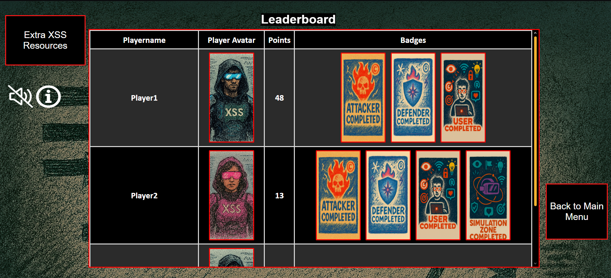

# The XSS Game (TXG)

**Enhancing Cybersecurity Education Through Multi-Opposing-Role Gameplay, Interactive Simulations, and In-Game Feedback**

[](LICENSE)

---

## Overview

**The XSS Game (TXG)** is an educational web-based game designed to teach players about **Cross-Site Scripting (XSS) vulnerabilities** in an engaging and interactive way. 

Key features include:

- **Multi-opposing-role gameplay**: Players assume different roles such as **Attacker**, **Defender (Developer)** and **User**, with competing objectives, promoting strategic thinking and realistic security decision-making.  
- **Interactive narrative-based simulations**: Players navigate real-world inspired scenarios to learn secure coding practices.  
- **In-game feedback**: Player Statboard and badges provide real-time feedback and motivation. 

**TXG Gameplay Flowchart**  
  
The game employs a multi-opposing-role gameplay flow with pre- and post-surveys.

TXG runs entirely in the browser — no installation or backend server is required. Simply download the repository and open `index.html`.

---

## Folder Structure

```

TheXSSGame/
├── images/          # Images used in the game
├── music/           # Background music and sound effects
├── scripts/         # JavaScript files for game logic
├── gdpr.html        # GDPR compliance and privacy information
├── index.html       # Main HTML file to launch the game
├── style.css        # Main CSS file for styling
├── README.md        # Project README
└── ATTRIBUTIONS.md  # Icon, sound, and library attributions

````

---

## Screenshots

Here are some example screenshots from the game:

**Start Menu**  
  
The initial screen where players can start the game, select options, and view instructions.

**Player Name & Avatar Selection**  
  
Players can choose their in-game name and avatar before starting.

**Player Role Selection**  
  
Select your role: Attacker, Defender (Developer), or User.

**Pre-Game Survey**  
  
Players answer a brief survey to capture demographics and prior knowledge.

**Gameplay**  
  
Interactive XSS challenges with dynamic scenarios.

**Answer Description**  
  
Detailed feedback is provided after each challenge to explain correct answers.

**Simulation Zone**  
  
A safe environment to test attack scenarios and learn from simulations.

**Player Statboard**  
  
Track points, badges, progress and receive feedback in real-time.

**Post-Game Survey**  
  
Survey to assess knowledge gained and gather feedback from players.

**Leaderboard**  
  
Leaderboard with player score and badges ranked according to player score.

---

## Getting Started

To play **The XSS Game**:

1. **Clone or download the repository:**

```bash
git clone https://github.com/darkcyberwizard/TheXSSGame.git
````

Or download as a ZIP and extract.

2. **Open the game:**

* Navigate to the project folder
* Open `index.html` in your preferred web browser

> ⚠️ No additional setup is required. The game runs fully in the browser.

---

## Usage

* Follow the on-screen instructions to navigate the game.
* Explore different XSS challenges and scenarios.
* Use the **Simulation Zone** to test different attack scenarios safely.
* Earn points and badges, and track your progress via the **Player Statboard**.

---

## Citation

Please cite TXG if used in research or coursework:

### BibTeX

```bibtex
@article{Weeratunge_2025a,
  title={Enhancing Cybersecurity Education Through Multi-Opposing-Role Gameplay and Simulations},
  volume={19},
  ISSN={2049-0992},
  url={http://dx.doi.org/10.34190/ecgbl.19.2.3993},
  DOI={10.34190/ecgbl.19.2.3993},
  number={2},
  journal={European Conference on Games Based Learning},
  publisher={Academic Conferences International Ltd},
  author={Weeratunge, Nipuna Hiranya and Hjelsvold, Rune},
  year={2025},
  month=sep,
  pages={873–882}
}

@article{Weeratunge_2025b,
  title={Enhancing Cybersecurity Learning with In-Game Feedback},
  volume={19},
  ISSN={2049-0992},
  url={http://dx.doi.org/10.34190/ecgbl.19.2.3994},
  DOI={10.34190/ecgbl.19.2.3994},
  number={2},
  journal={European Conference on Games Based Learning},
  publisher={Academic Conferences International Ltd},
  author={Weeratunge, Nipuna Hiranya and Hjelsvold, Rune},
  year={2025},
  month=sep,
  pages={883–891}
}
```

---

## License

This project is licensed under the **MIT License** – see [LICENSE](LICENSE) for details.

---

## Contact

* **Nipuna H. Weeratunge** – [GitHub](https://github.com/darkcyberwizard) | [Email](mailto:nipuna.h.weeratunge@gmail.com)

---

Enjoy learning and playing! 🚀

---
